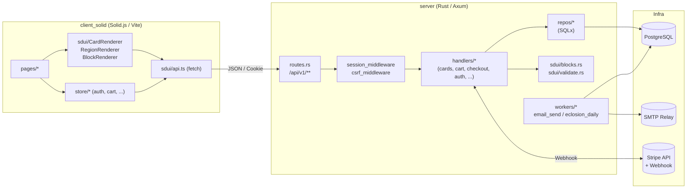
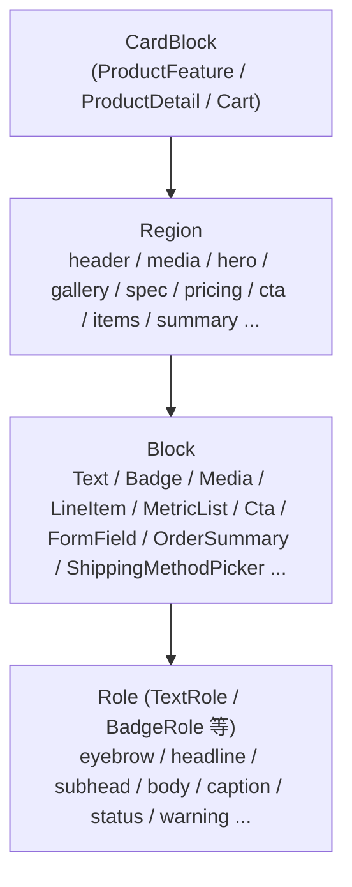
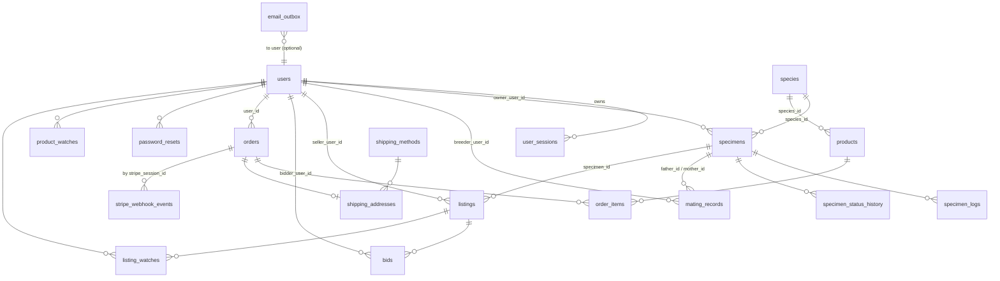
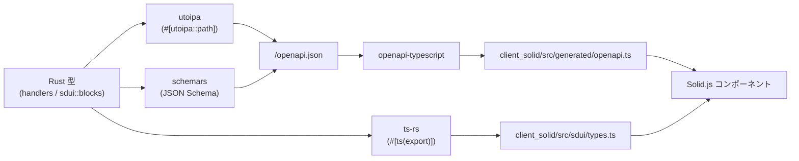
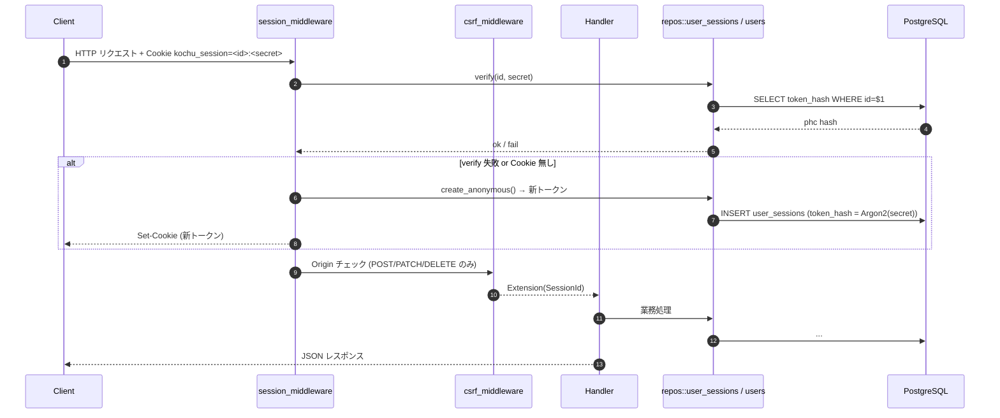
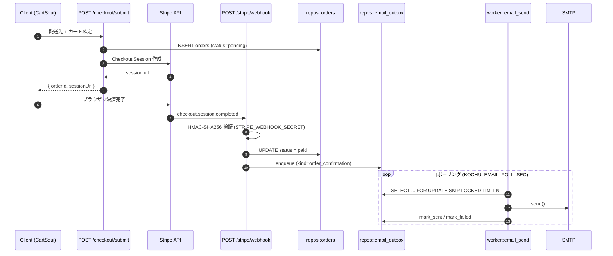
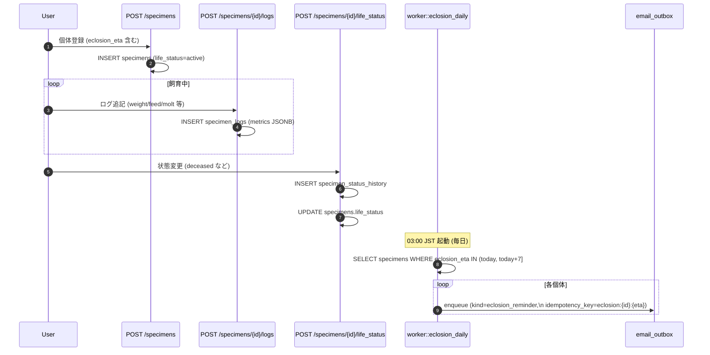
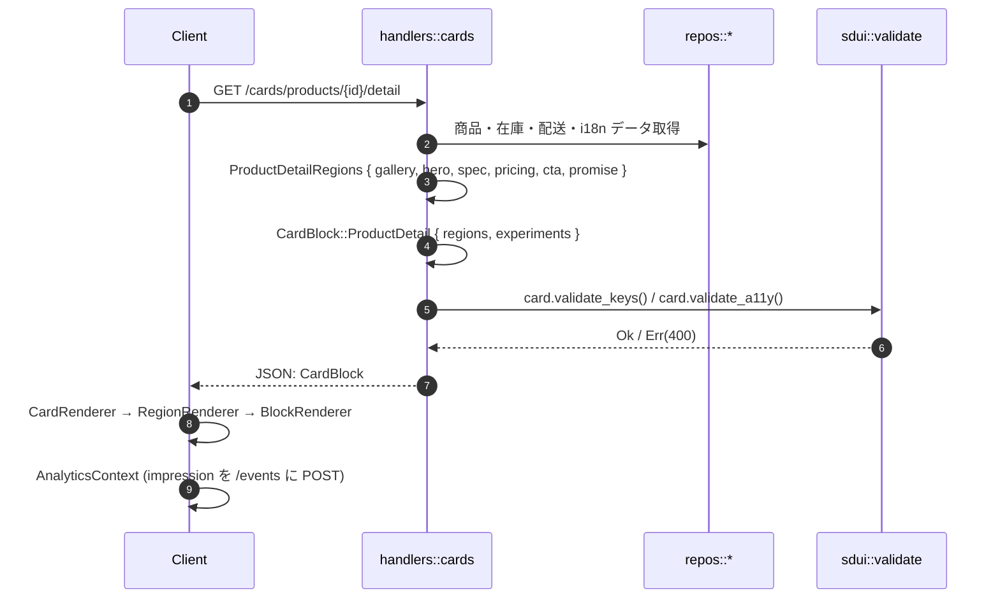

> **読み方**: このページは新規開発者が短時間で全体像を掴むための導線です。SDUI に閉じた話は [SDUI 三層モデル概観](/insect_app/architecture/sdui-overview/) と [SDUI v6 設計書 (正典)](/insect_app/architecture/sdui-three-layer-model-v6/) を、API の逆引きは [`/api/v1/*` エンドポイント一覧](/insect_app/architecture/api-v1-endpoints/) を参照してください。
>
> **正典**: `docs/design-overview.md` (リポジトリ直下) が source of truth。本ページはそのミラーです。

最終更新: 2026-04-29

## 1. プロダクト概要

`insect_app` は **昆虫（カブト・クワガタ等）の飼育管理 × EC × C2C マーケット** を統合した Web アプリケーションです。主な機能ドメインは以下の 4 つです。

- **個体管理 (Specimen)** — 卵 / 幼虫 / 蛹 / 成虫のライフサイクル記録、給餌・体重・脱皮ログ、血統 (父母) リンク
- **繁殖管理 (Mating / Bloodline)** — ペアリング記録、産卵数、孵化予測の日次バッチ
- **EC (B2C)** — 商品カタログ、カート、Stripe による決済、注文履歴
- **マーケット (C2C)** — 出品、入札（オークション）、ウォッチリスト

UI は **SDUI (Server-Driven UI) v6** という独自スキーマでサーバから配信し、クライアントは描画に専念する構造を取っています。

---

## 2. リポジトリ構成

```
insect_app/
├── server/                 # Rust / Axum バックエンド
│   ├── src/
│   │   ├── main.rs         # 起動エントリ。Pool 初期化・キャッシュ warm・Worker 起動
│   │   ├── lib.rs          # 公開モジュール
│   │   ├── routes.rs       # /api/v1 ルーティング
│   │   ├── state.rs        # AppState { db: Option<PgPool> }
│   │   ├── session.rs      # Cookie セッション + CSRF ミドルウェア
│   │   ├── error.rs        # AppError → IntoResponse
│   │   ├── openapi.rs      # utoipa による OpenAPI ドキュメント
│   │   ├── handlers/       # Axum ハンドラ群（リクエスト処理）
│   │   ├── repos/          # SQLx を使うデータアクセス層
│   │   ├── sdui/           # SDUI 型定義・バリデーション
│   │   ├── workers/        # 非同期ワーカー（email_send, eclosion_daily）
│   │   └── stripe/         # Stripe 連携・Webhook 検証
│   └── migrations/         # PostgreSQL マイグレーション (sqlx)
├── client_solid/           # Solid.js フロントエンド (TypeScript / Vite)
│   └── src/
│       ├── App.tsx         # ルート + グローバルストア
│       ├── pages/          # 画面コンポーネント
│       ├── components/     # 再利用コンポーネント
│       ├── sdui/           # SDUI レンダラ・型 (ts-rs 生成)
│       └── store/          # Solid 反応的ストア (auth, cart, ...)
├── docs-site/              # Astro + Starlight ドキュメントサイト（本サイト）
└── docs/                   # 設計ドキュメント（正典）
```

---

## 3. 技術スタック

| レイヤ | 採用技術 | 補足 |
|---|---|---|
| HTTP サーバ | Axum 0.8 / Tokio 1 | ミドルウェア: Cookie セッション + CSRF + tracing + CORS |
| DB | PostgreSQL + SQLx 0.8 | コンパイル時クエリ検証 (`query_as!`) |
| 認証 | Argon2id + Cookie セッション | パスワード/セッショントークンの両方を phc 形式でハッシュ |
| API スキーマ | utoipa 5 (OpenAPI) | `/openapi.json` + Swagger UI |
| 型生成 | ts-rs 9 / schemars 0.8 | Rust → TypeScript / JSON Schema |
| 決済 | Stripe (Webhook は HMAC-SHA256 検証) | `STRIPE_WEBHOOK_SECRET` 必須（本番） |
| メール | lettre 0.11 (SMTP) + 独自 Mailer Trait | 開発時は StubMailer |
| ジョブ | `tokio::spawn` + `FOR UPDATE SKIP LOCKED` | 自前リレー。apalis 等は使用しない |
| クライアント | Solid.js 1.9 / @solidjs/router | Vite 5 / Vitest 2 |
| 型連携 | openapi-typescript 7 | `/openapi.json` から fetch クライアント自動生成 |

---

## 4. システム全体アーキテクチャ



### 4.1 SDUI 三層モデル

UI はサーバが組み立てた `CardBlock` を JSON で返し、クライアントが描画します。



意図は次の 3 点です。

- レイアウト変更を **デプロイ無し** で配信する（A/B テスト・実験）
- アクセシビリティ規則 (`headline` ブロックは Region 内に最大 1 つ等) を **サーバ側で強制**
- Rust の型 (`Block`, `Localizable`, `Href`) を `ts-rs` で TypeScript に同期し、**型安全** に描画

---

## 5. データモデル / DB スキーマ

マイグレーションは `server/migrations/` にあり、現状 `0001`〜`0018` まで一方向で適用されます。主要テーブルを ER 図で示します。



### 5.1 主要テーブル

| テーブル | 役割 | 重要カラム |
|---|---|---|
| `users` | アカウント | `public_id`, `role` (breeder/admin/shop_owner), `password_hash` (Argon2 phc) |
| `user_sessions` | Cookie セッション | `token_hash` (Argon2), `user_id` (NULL 可 = 匿名), `expires_at` |
| `specimens` | 飼育個体 | `public_id`, `species_id`, `sex`, `stage`, `eclosion_eta`, `father_id`, `mother_id`, `life_status` |
| `specimen_logs` | 飼育ログ | `log_type` (weight/feed/mat/molt/observation), `metrics` (JSONB) |
| `specimen_status_history` | 個体状態履歴（**immutable**） | `status`, `changed_at`, `author_user_id` |
| `mating_records` | 繁殖記録 | `father_id`, `mother_id`, `mated_at`, `egg_count`, `status` |
| `products` | EC 商品 | カテゴリ・難易度フィルタ |
| `orders` / `order_items` | EC 注文 | `stripe_session_id`, `status` (pending/paid/failed/canceled), `fulfilled_specimen_id` |
| `cart_items` | カート (セッション単位) | `undoable_token` で削除復元 |
| `listings` / `bids` | C2C 出品・入札 | `is_auction`, `current_price_jpy`, `ends_at` |
| `email_outbox` | メール送信キュー | `kind`, `template_args` (JSONB), `status`, `idempotency_key` |
| `stripe_webhook_events` | Webhook 監査ログ | event id を一意に保持 |
| `assets` | アップロード資産 | `status` (pending/uploaded) — 3 段階アップロード |

詳細なテーブル定義および設計判断は [DB スキーマ設計](/insect_app/architecture/db-schema-design/) を参照してください。

### 5.2 設計の勘所

- **個体状態は履歴を残す**（Medium #3 規律）。`specimens.life_status` の更新と同時に `specimen_status_history` へ INSERT し、履歴は削除しない。
- **メール送信は冪等**。`email_outbox.idempotency_key` (例 `eclosion:{specimen_id}:{eta}`) に UNIQUE 制約を張り、日次バッチの再実行で重複送信しない。
- **Pool が無くても動く**。`AppState.db: Option<PgPool>` とし、各 repo は `pool=None` のときスレッドローカルなインメモリストアへフォールバックする。MVP/開発・テスト時に有効。
- **マスタは OnceLock キャッシュ**。products フィルタ、shipping_methods、prefectures は起動時に warm し、handler から参照する。

---

## 6. API / 型契約

### 6.1 ルーティング (代表例)

`/api/v1` 配下に約 40 エンドポイント。`server/src/routes.rs` 参照。網羅的な逆引きは [`/api/v1/*` エンドポイント一覧](/insect_app/architecture/api-v1-endpoints/) を参照してください。

| カテゴリ | メソッド + パス | 説明 |
|---|---|---|
| SDUI | `GET /cards/products`, `/cards/products/{id}`, `/cards/products/{id}/detail`, `/cards/cart` | カード/領域/ブロックを組み立てて返す |
| Cart | `POST /cart` / `PATCH /cart/items/{token}` / `DELETE /cart/items/{token}` | セッション単位のカート操作 |
| Checkout | `PATCH /checkout/shipping_field/{name}` / `/checkout/shipping_method` / `POST /checkout/submit` | 配送先入力 → Stripe Session 生成 |
| Auth | `POST /auth/register|login|logout` / `GET /auth/me` / `POST /auth/password_reset_request|confirm` | 登録・ログイン・パスワードリセット |
| Specimen | `GET /specimens/me` / `POST /specimens` / `GET /specimens/{public_id}` / `PATCH /specimens/{id}/notes` / `POST /specimens/{id}/life_status` | 個体管理 |
| Logs | `POST /specimens/{id}/logs` / `GET /specimens/{id}/logs` / `GET /me/logs` | 飼育ログ |
| Mating | `POST /mating_records` / `GET /mating_records/me` / `POST /mating_records/{id}/status` | 繁殖記録 |
| Market | `GET|POST /listings` / `GET /listings/{public_id}` / `POST /listings/{id}/bids|watch` | C2C |
| Orders | `GET /orders/me` / `GET /orders/{id}` | 注文履歴 |
| Webhook | `POST /stripe/webhook` | Stripe からの通知（CSRF 例外） |

### 6.2 型契約のフロー



クライアント側の型生成スクリプト:

- `npm run gen:openapi` — `/openapi.json` を取得し `openapi-typescript` で fetch クライアント生成
- `npm run gen:sdui` — `cargo build` で ts-rs を起動し SDUI 型をエクスポート

### 6.3 ハンドラ実装パターン

```rust
#[utoipa::path(post, path = "/api/v1/cart", responses((status = 200, body = CartResponse)))]
pub async fn add_to_cart(
    State(state): State<AppState>,
    Extension(session_id): Extension<SessionId>,
    Json(body): Json<AddToCartRequest>,
) -> Result<Json<CartResponse>, AppError> {
    let item = repos::cart_items::add_to_cart(state.db.as_ref(), session_id, body).await?;
    Ok(Json(CartResponse::from(item)))
}
```

戻り値は `Result<Json<T>, AppError>`。`AppError` は `IntoResponse` を実装し、`NotFound` / `BadRequest(String)` / `Unauthorized` / `Internal(anyhow::Error)` を JSON エラーへ変換します（`server/src/error.rs`）。

### 6.4 SDUI バリデーション

`server/src/sdui/validate.rs` に 2 つの trait があり、ハンドラはレスポンス組立後に必ず呼びます。

- **`ValidateKeys`** — `Block.key` の一意性を `CardBlock` 単位で検証（複合キーは `<block.key>::<item.key>`）
- **`ValidateA11y`** — Region 内の `headline` ロール Block を最大 1 つに制限（スクリーンリーダ要件）

検証失敗時は 400 Bad Request を返却。

---

## 7. 処理フロー（シーケンス）

### 7.1 認証 + セッションミドルウェア



ポイント:

- セッションは **常に発行** され、未ログイン (`user_id = NULL`) でもカートやウォッチが追跡できる
- ログイン時は同じセッションに `user_id` を紐づけ、`cart_items` / `product_watches` を user 所有へ昇格
- CSRF は Origin ヘッダ検証で実装し、`/stripe/webhook` のみ例外

### 7.2 チェックアウト → Stripe Webhook → 注文確定 → メール



メールリレーは **`FOR UPDATE SKIP LOCKED`** で複数ワーカー間の競合を防ぎ、開発時は `StubMailer` がログ出力に切り替わります（`KOCHU_WORKER_ENABLE`, `Mailer` trait）。

### 7.3 個体ライフサイクル + 孵化リマインダ



`idempotency_key` の UNIQUE 制約により、同じ個体・同じ予測日のリマインダは複数日跨いでも 1 通だけ送られます。

### 7.4 SDUI レンダリング



クライアントは `CardRenderer` → `RegionRenderer` → `BlockRenderer` のディスパッチのみで、レイアウトロジックを持ちません。`AnalyticsContext` がインプレッション/クリックイベントをまとめて `POST /events` に送信します。

---

## 8. バックグラウンドワーカー

`server/src/workers/` に 2 種類。`KOCHU_WORKER_ENABLE=true` のとき `spawn_all(state)` から起動します。

| ワーカー | 起動契機 | 責務 |
|---|---|---|
| `email_send` | `KOCHU_EMAIL_POLL_SEC` (既定 2 秒) ポーリング | `email_outbox` の `pending` を `FOR UPDATE SKIP LOCKED` で取り、Mailer 実装で送信 |
| `eclosion_daily` | 03:00 JST (= 18:00 UTC) | 7 日以内に羽化予測がある個体を抽出し、`email_outbox` に冪等エンキュー |

`Mailer` トレイトは `StubMailer` (開発: tracing ログ + 内部 Vec) と `AsyncSmtpTransport` (本番: lettre 経由 SMTP) の 2 実装を切替可能です。

---

## 9. 環境変数 / 運用上の注意

| 変数 | 用途 | 備考 |
|---|---|---|
| `DATABASE_URL` | PostgreSQL 接続 | 失敗時はインメモリフォールバック (MVP) |
| `KOCHU_ENV` | `production` のとき下記 3 つを必須化 | — |
| `STRIPE_WEBHOOK_SECRET` | Webhook HMAC 検証 | 本番必須 |
| `KOCHU_ALLOWED_ORIGINS` | CSRF Origin 許可リスト | 本番必須 |
| `KOCHU_COOKIE_SECURE` | `true` で Set-Cookie に Secure 付与 | 本番必須 |
| `KOCHU_WORKER_ENABLE` | ワーカー起動可否 | サービス分離時は false |
| `KOCHU_EMAIL_POLL_SEC` | email_send のポーリング間隔 | 既定 2 秒 |

---

## 10. 主要な設計判断と理由

1. **SDUI を採用** — レイアウト/A11y/実験フラグをサーバで管理し、クライアント変更なしで段階リリースできる。
2. **セッショントークンも phc 形式で保存** — Argon2 のパラメータをハッシュに埋め込むことで、将来のセキュリティパラメータ変更に耐性を持たせる。
3. **個体状態履歴は immutable** — 監査・血統トレーサビリティ要件に対応するための規律。
4. **In-Memory フォールバック** — Pool 未接続でもエンドポイントが動作。MVP のローカル開発と CI を高速化。
5. **マスタは `OnceLock` で warm** — products / shipping_methods / prefectures は起動時にロードし、ホットパスで DB 不要。
6. **メールは冪等エンキュー + リレー** — `FOR UPDATE SKIP LOCKED` で複数インスタンス対応、`idempotency_key` で重複送信防止。
7. **Stripe Webhook は CSRF 例外** — 外部から POST を受けるため Origin チェックを skip し、HMAC 検証で代替。
8. **ts-rs + schemars + utoipa の三本柱** — Rust の型 1 つから TS 型・JSON Schema・OpenAPI が同時に出るため、契約のドリフトが起きにくい。

---

## 11. 開発者がはじめに見るべきファイル

| 目的 | ファイル |
|---|---|
| 起動シーケンスを追う | `server/src/main.rs` |
| ルーティング全体像 | `server/src/routes.rs` |
| 認可・セッション | `server/src/session.rs` |
| エラー方針 | `server/src/error.rs` |
| SDUI 型定義 | `server/src/sdui/blocks.rs` |
| SDUI バリデーション | `server/src/sdui/validate.rs` |
| 決済 Webhook | `server/src/handlers/stripe_webhook.rs` |
| 日次バッチ | `server/src/workers/eclosion_daily.rs` |
| クライアント起点 | `client_solid/src/App.tsx` |
| SDUI レンダラ | `client_solid/src/sdui/CardRenderer.tsx` |
| 型生成スクリプト | `client_solid/scripts/gen-openapi.mjs`, `gen-sdui-types.mjs` |
| マイグレーション一覧 | `server/migrations/` |

---

## 付録 A. SDUI コア型 (抜粋)

```rust
// server/src/sdui/blocks.rs
pub enum Block {
    Text { key: String, role: TextRole, content: Localizable, analytics_id: Option<String> },
    Badge { key: String, role: BadgeRole, label: Localizable, analytics_id: Option<String> },
    Media { key: String, kind: MediaKind, src: String, alt: Localizable, /* ... */ },
    LineItem { key: String, title: Localizable, unit_price: MetricItem, /* ... */, actions: Option<LineItemAction> },
    MetricList { key: String, items: Vec<MetricItem> },
    MetaLine { key: String, role: MetaLineItemRole, label: Localizable, value: Localizable },
    Cta { key: String, action: CtaAction, label: Localizable, intent: CtaIntent, /* ... */ },
    FormField { key: String, kind: FormFieldKind, label: Localizable, value: String, /* ... */ },
    OrderSummary { key: String, subtotal_amount: i64, shipping_amount: Option<i64>, tax_included: bool, /* ... */ },
    ShippingMethodPicker { key: String, options: Vec<ShippingMethodOption>, selected_id: String, /* ... */ },
    // ... EclosionForecast, Divider, Price
}

pub enum Localizable {
    Raw { text: String },
    I18nRef { key: I18nKey, fallback: Option<String> },
}

pub struct Href(String);    // "/..." または "https://..." のみ許容
pub struct I18nKey(String); // "scope.key" 形式
```

## 付録 B. AppError → HTTP 対応

| バリアント | HTTP | 用途 |
|---|---|---|
| `NotFound` | 404 | リソース未発見 |
| `BadRequest(String)` | 400 | 入力検証エラー、SDUI バリデーション失敗 |
| `Unauthorized` | 401 | 未ログイン / セッション無効 |
| `Internal(anyhow::Error)` | 500 | 想定外エラー（ログ出力後にマスク） |
