# KOCHU insect_app システムデザイン (外部レビュー版)

| 項目 | 値 |
|---|---|
| 対象読者 | 外部レビュアー (= 設計の妥当性・前提・トレードオフを判断する第三者) |
| ステータス | **POC / MVP 構築中** (実コード: `server/` `client_solid/`、migration 0001〜0026) |
| 作成日 | 2026-05-09 |
| 範囲 | サーバ・クライアント・データ・デプロイの全体像と、技術選定の意思決定が見える粒度 |
| 範囲外 | 全テーブル定義、全 API、全画面 (= `db_design.md` / `docs/api-v1-endpoints.md` / `system-design-report.md` を参照) |

このドキュメントは **「なぜそう作ったか」** が分かることを優先し、図と判断理由を中心に書く。実装の網羅は別ドキュメントに譲る。

---

## 1. レビューにあたっての前提

### 1.1 ドメイン

カブトムシ・クワガタを継代繁殖する **ブリーダー間 (C2C) の個体取引** と **個体ごとの飼育カルテ管理** を 1 つのデータモデルに統合したサービス。「飼育の歴史」が出品ページに紐づき、購入確定で個体の所有権が DB 上で移転する点が肝。

### 1.2 フェーズ

POC を超え MVP に入る境界。コードは動くが本番運用していない。`docker-compose.yml` で PostgreSQL を立て、`cargo run` で Axum を起動して開発する。AWS デプロイは未実施で `docs/infra/` に設計のみ。

### 1.3 直近で大きく変更した点 (= レビュー時に見落としやすい)

- **C2C ピボット (migration 0021)**: 旧 B2C 商品テーブル群 (`products` / `product_translations` / `product_bloodlines` / `product_watches`) を **全廃**。販売対象は `listings` のみ。`db_design.md` の §3 (product 系) は歴史記録で、現スキーマには存在しない。
- **インフラ AWS 統一 (2026-05)**: 旧 Cloudflare / 自前 Meilisearch / 自前 Redis を廃し、Aurora / ElastiCache / OpenSearch / S3 / CloudFront に集約。

### 1.4 スコープ判断 (MVP に含む / 含まない)

| 含む | 含まない (発動条件で後付け) |
|---|---|
| ブリーダー登録・認証 (Email + OAuth 予定) | Android ネイティブアプリ |
| 個体カルテ + 飼育ログ + 状態遷移履歴 | 動画アップロード (= MediaConvert は要件確定後) |
| C2C 出品 (即決 + オークション) | OpenSearch 全文検索 (= 当面 `pg_trgm` で代替) |
| Stripe Checkout + Stripe Connect (= 売上送金) | Bedrock 連携 AI 機能 |
| メール (SES) + iOS Push (SNS Mobile Push) | SMS / 多言語 / 国内決済代替 |
| 画像 S3 ダイレクトアップロード | 羽化予測 (= 一旦保留) |

「発動条件で後付け」の根拠は §8.4 の段階追加方針を参照。

---

## 2. システムコンテキスト (C4 Level 1)

ユーザーと外部システムから見た「箱としての KOCHU」。

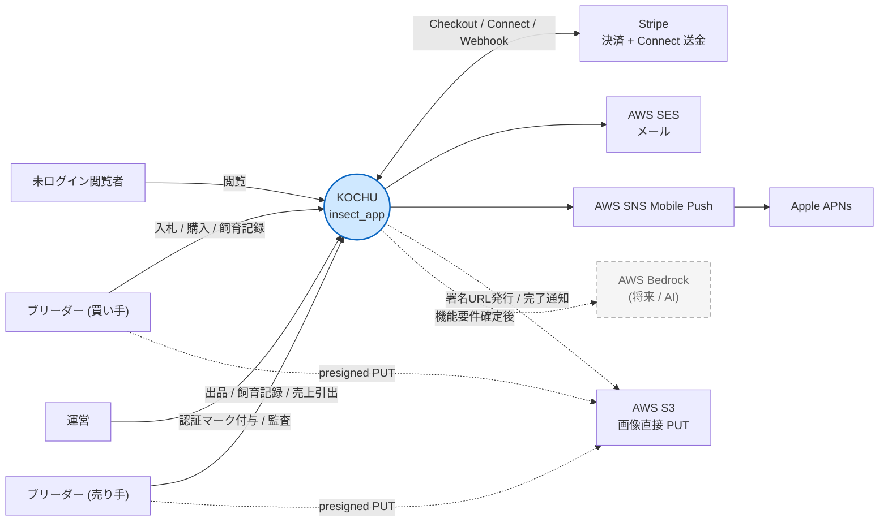

**前提**: 外部依存は Stripe (代替不可) と Apple APNs (= iOS Push のため不可避) のみ。それ以外は AWS 内部に閉じ、ベンダーロックを 1 社に絞ることで運用と監査を単純化する。

---

## 3. コンテナ図 (C4 Level 2)

KOCHU の内部を「動くプロセス」「データストア」単位で展開。実線は MVP で建てる構成、点線は段階追加。

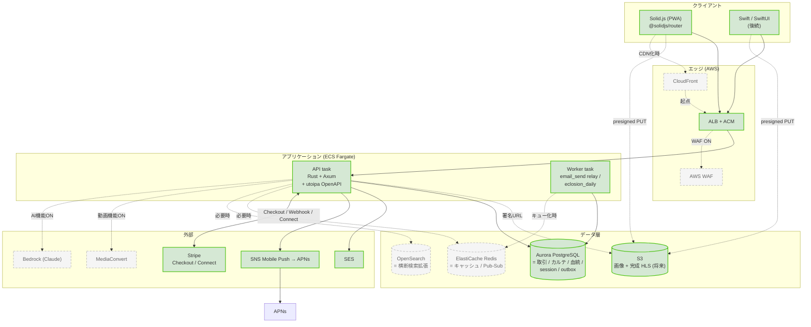

**コンテナ別の役割**

| コンテナ | 実装 | 役割 | 備考 |
|---|---|---|---|
| Web client | Solid.js + `@solidjs/router` (`client_solid/`) | PWA、画面描画と入力。SDUI レイヤーで一部画面はサーバ駆動 | bun + Vite ビルド |
| iOS client | Swift / SwiftUI (未着手) | 同上、ネイティブ | 型は OpenAPI から生成予定 |
| API task | Axum + sqlx (`server/`) | 全 REST、Cookie session、Stripe 受信 | 1 binary に handlers + workers を内包 |
| Worker task | 同 binary を `KOCHU_WORKER_ENABLE=true` で起動 | email_outbox relay / eclosion_daily | ECS で task を分けて起動する想定 |
| PostgreSQL | Aurora Serverless v2 (本番) / Docker (開発) | 取引・カルテ・session・outbox の単一の真実 | 検索は当面 `pg_trgm` で代替 |
| S3 | バケット用途別分離 | 画像 / (将来) HLS / バックアップ | クライアントから直接 PUT、サーバは署名 URL のみ発行 |

---

## 4. バックエンド コンポーネント図 (C4 Level 3)

`server/src/` の実装と 1:1 で対応する内訳。

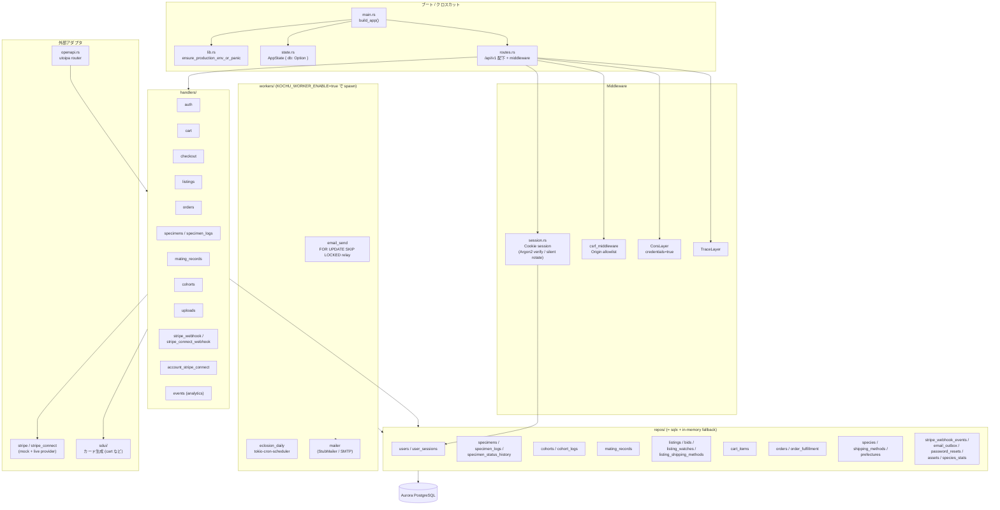

**設計判断 (= 実装に現れている主要な意思決定)**

1. **`AppState.db: Option<PgPool>`** — pool が無くても各 repo が in-memory fallback に倒れるため、`cargo test` や DB 不在の dev で server が起動可能 (`server/src/state.rs`)。production では `db::init_pool` 直接呼び出しに切り替えて DB 不在 = fatal にする方針。
2. **`session_middleware` で全 `/api/v1/*` を被覆**、新規発行は **silent rotate** (cookie が古い形式・期限切れ・改ざんでも 500 を返さない)。secret は Argon2id で `user_sessions.token_hash` に保存。
3. **CSRF は Origin ヘッダ照合** (`KOCHU_ALLOWED_ORIGINS` CSV 一致)。Stripe webhook は HMAC で別経路保護されるので CSRF skip。
4. **OpenAPI は utoipa で handler から派生** (`server/src/openapi.rs`)。コードを真とし、ドキュメントを後追いさせる。
5. **Workers は同 binary に内包**して `KOCHU_WORKER_ENABLE=true` のとき `tokio::spawn`。ECS では task を分離して起動する想定 (web のみ / worker のみ)。`apalis` を採用しなかったのは relay loop 用途なら自前で十分という判断。

---

## 5. データモデル

全テーブル定義は `db_design.md` に。ここでは外部レビューで重要な「集約」と「不可逆履歴」の構造に絞る。

### 5.1 主要エンティティ関係 (現行 = C2C ピボット後)

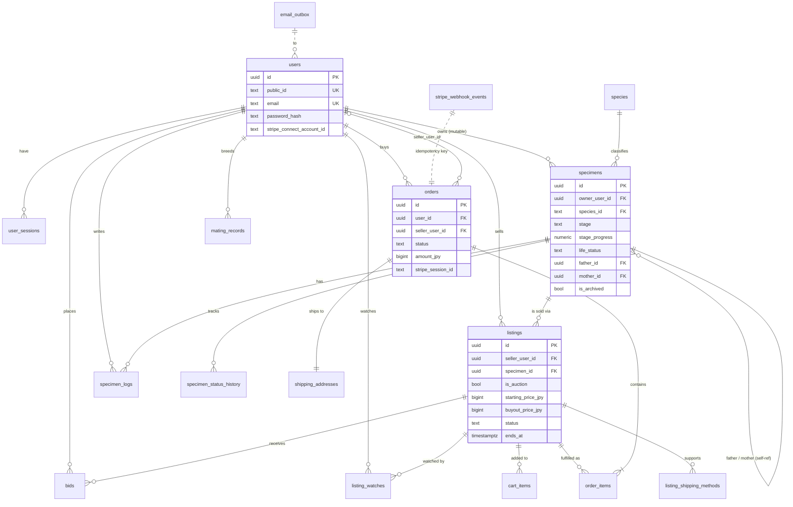

### 5.2 主要な状態遷移 (= 不可逆履歴を伴うもの)

#### 5.2.1 `specimens.life_status`

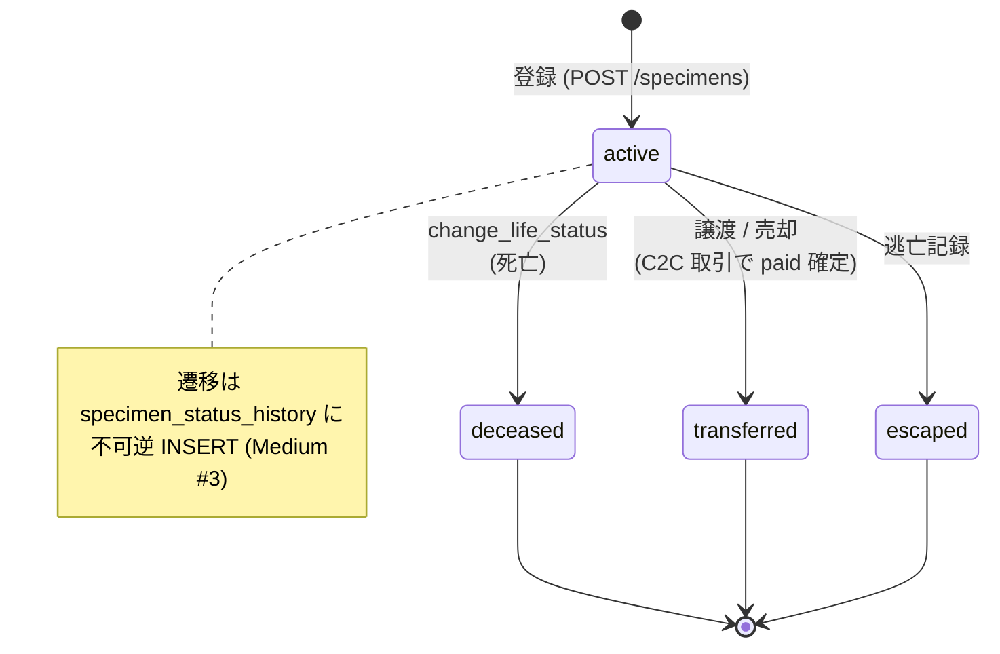

#### 5.2.2 `listings.status` × `orders.status` (購入トランザクション)

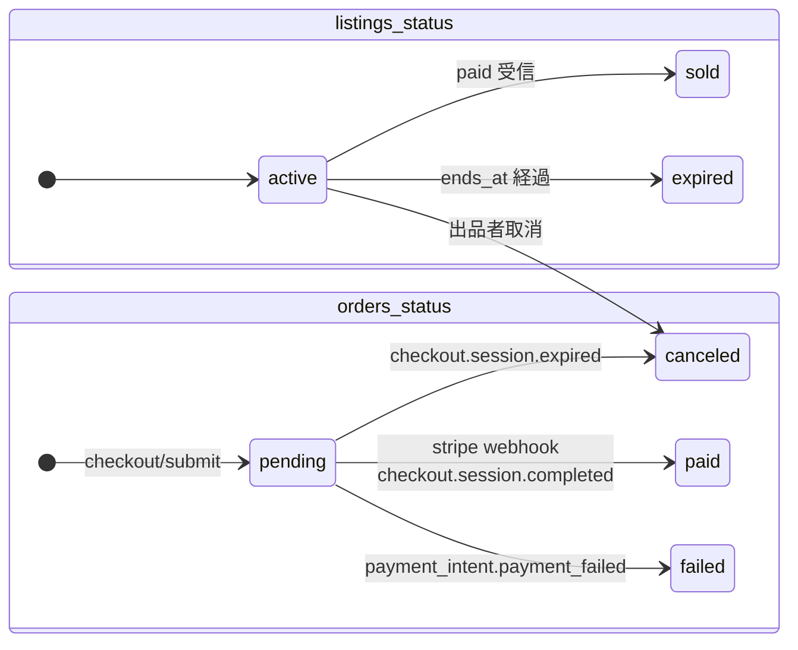

#### 5.2.3 `mating_records`

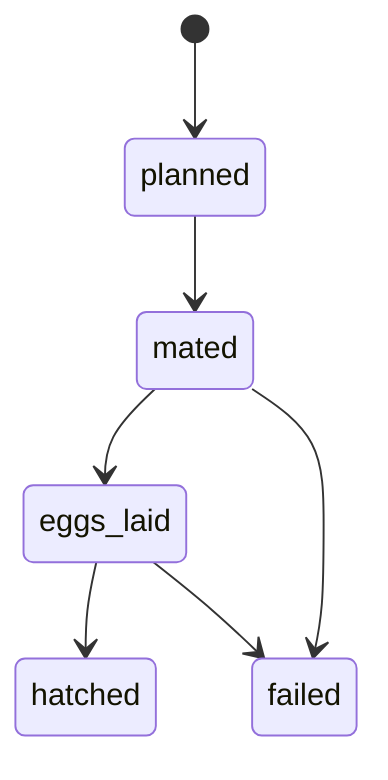

### 5.3 設計の要

「**所有者の付け替え**」だけで C2C 取引と飼育履歴の継承が同時に成立する。`specimens` は譲渡されても同じ `id` のまま `owner_user_id` だけが変わるので、過去ログ・親子関係 (= `father_id` / `mother_id` 自己参照) はそのまま継承される。出品 (`listings`)・注文 (`orders`)・所有 (`specimens.owner_user_id`) は同じ DB の異なる側面を見ているにすぎない。

---

## 6. SDUI (Server-Driven UI) レイヤー

KOCHU は一部画面を **サーバが UI 構造を JSON で返し、クライアントは render するだけ** という Server-Driven UI モデルで実装している。テンプレート全体ではなく、特定のカード / セクション / 一覧シェル / カート / チェックアウトに限定して採用している点と、**Rust 側を型の単一ソース** にしている点が特徴。

詳細仕様は `docs/sdui-three-layer-model-v6.md`。本章は外部レビュー視点で「採用範囲・契約・型生成・検証・運用上の不変条件」をまとめる。

### 6.1 採用範囲と狙い

**採用している領域**

| 領域 | サーバ実装 | クライアント実装 | 状態 |
|---|---|---|---|
| カード (一覧・詳細・カート 3 テンプレート) | `server/src/sdui/blocks.rs` `regions.rs` | `client_solid/src/sdui/templates/` | 型は確定、カードを返す REST 出口は C2C ピボットで一旦撤去 (§6.7) |
| 一覧シェル (filter / sort / pagination / search) | `sdui/list.rs` | `sdui/FilterBar.tsx` `SortBar.tsx` `Pagination.tsx` `SearchBox.tsx` | 型は確定、`/api/v1/cards/products` 出口は撤去待ち |
| Analytics ingest (impression / click) | `sdui/analytics.rs` + `handlers/events.rs` | `sdui/analytics.ts` + `TrackImpression.tsx` | 稼働中 (`POST /api/v1/events`) |
| Checkout フォーム (`form_field` / `shipping_method_picker`) | `handlers/checkout.rs` | `sdui/blocks/FormField.tsx` `ShippingMethodPicker.tsx` | 稼働中 (`PATCH /api/v1/checkout/shipping_field/{name}` 等) |

**狙い**

- 運営 / ブリーダーが将来 CMS から **「画像・順序・コピー・CTA 文言」を変更** できる土台を、コード変更なしで作れるようにする。
- A/B テストの **バケット切替を JSON のフィールドとして配信** できるようにする (`Experiment { key, bucket }`)。
- アクセシビリティ・デザインシステム・パフォーマンスを **クライアントコード側の不変条件** で守り、コンテンツの自由度と表現の固さを両立させる。

**非採用領域** (= 通常の REST + 通常の Solid コンポーネント)

- 個体カルテ / 飼育ログ / 出品作成フォームなど、入力中心で「同じ画面構造を全ユーザーに出す」ページ。SDUI を入れる利得が薄い。
- 認証・決済の遷移系。Cookie session と Stripe webhook が主役で、UI は補助。

### 6.2 三層モデル (Region → Block → Template)

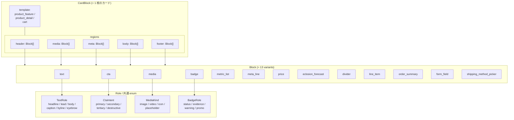

**三層の責務分離**

| 層 | 責務 | 例 |
|---|---|---|
| **Region** | 画面上の場所 (= header / body / footer 等)。テンプレートごとに許容集合が違う | `ProductDetailRegions.gallery` だけ画像メイン |
| **Block** | 意味的に最小の部品 1 個 | 「価格 1 行」「CTA 1 個」「フォームの 1 入力」 |
| **Role / Template** | 視覚的役割 (= デザインシステム経由でスタイル決定) | `text.role: headline` で見出し級フォント |

**テンプレートごとの Region 集合は Rust の専用 struct で握る**。`#[serde(deny_unknown_fields)]` を付け、テンプレートが許容しないリージョンが入った JSON を deserialize 段階で 400 にする。

```rust
#[serde(deny_unknown_fields, rename_all = "camelCase")]
pub struct ProductFeatureRegions {
    pub header: Vec<Block>, pub media: Vec<Block>,
    pub meta:   Vec<Block>, pub body:  Vec<Block>,
    pub footer: Vec<Block>,
}
```

`product_feature` / `product_detail` / `cart` で使える region 集合は別 struct に分離されており、**テンプレート間で region 名を取り違えるとコンパイル + deserialize の二重で弾かれる**。

### 6.3 型生成パイプライン (= 二重防御)

サーバの Rust 型を **唯一の真実** とし、TypeScript と JSON Schema を機械生成する。クライアントとサーバの型ずれを構造的に防ぐ。

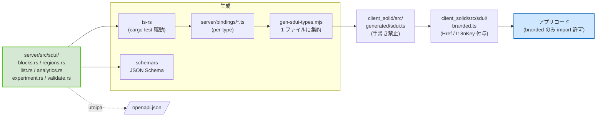

**重要な不変条件**

1. **`generated/sdui.ts` は手書き禁止**。`bun run gen:sdui` で再生成するのみ。
2. **アプリコードは `branded` のみ import**。`Href` / `I18nKey` などの branded 型を強制し、生 string が混ざらないようにする。
3. **JSON Schema (`schemars`) と TypeScript (`ts-rs`) を二重生成**。コンパイル時 + 実行時の両側で乖離を検知 (= property-based test も併用)。
4. **金額は `i64` → `#[ts(type = "number")]` で TS の `number` に倒す**。`BigInt` にしない (= JPY のみ運用前提、多通貨化時の minor unit 切替は §8 既知の妥協で予告)。

### 6.4 検証層 (Validation)

JSON が型に合うだけでは UI を壊さないことは保証できない。Rust 側で deserialize 後に追加検証を走らせる。

| 検証 | 場所 | 目的 |
|---|---|---|
| `deny_unknown_fields` | 全 Region struct / `AnalyticsEvent` / `ProductListResponse` 等 | サーバ実装の typo・古い client の field が **silently 通る事故を防ぐ** |
| `ValidateKeys` | `validate.rs::ValidateKeys` for `CardBlock` | Block.key の **カード内一意性**。`MetricItem.key` は `<block.key>::<item.key>` の合成キーで検証 |
| `ValidateA11y` | `validate.rs::ValidateA11y` | テンプレート内の **`text.role: headline` は 0 or 1 個** (= スクリーンリーダー破壊防止) |
| `Experiment::try_from` | `experiment.rs` | A/B キー (`^[a-z][a-z0-9_]*$`) / バケット (`^[A-Za-z0-9_-]+$`) の正規表現検証 |

`ValidateKeys` / `ValidateA11y` は **API ハンドラで deserialize 後に必ず呼ぶ規律**。失敗時は 400 を返す。

### 6.5 アクションの関心分離

CTA を SDUI で配信するとき、リンク遷移 (= `href`) と server side-effect (= "カートに追加") は別の概念。これを 1 つの enum に押し込まない設計を採っている。

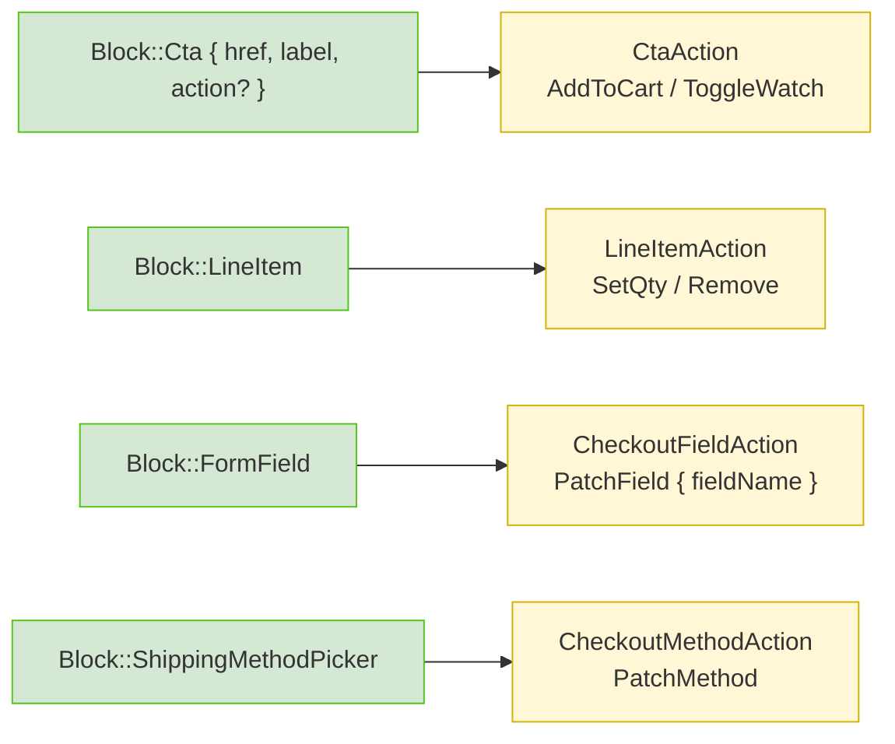

**意図**: 「カート行の qty 変更」と「商品詳細の CTA」は **意味も対応 endpoint も違う**。1 つの巨大 enum に統合すると `match` の網羅性が壊れ、未対応アクションを silently 落とすリスクが出る。Block ごとに専用 action 型を持たせることで、**block 種を増やすと対応 action 型を必ず作る** ことが型システムから強制される。

### 6.6 Analytics 計装 (best-effort + clock skew 対策)

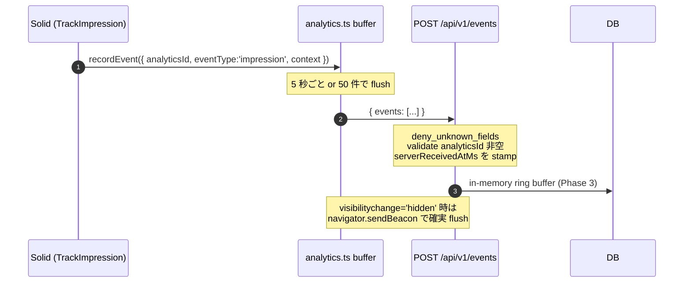

**設計上のポイント**

- **`timestampMs`** は client の `Date.now()`、**`serverReceivedAtMs`** はサーバが必ず stamp。**真実値は server 側**。client が偽装して送っても server の custom deserializer (`always_none`) で読み捨てる。
- **best-effort**: 失敗は黙って捨てる。再送・永続化は **しない**。理由は「計装の有無がアプリ動作に影響しない」を不変条件にするため。
- **`sendBeacon`**: タブ非表示時の取りこぼしを防ぐ。OS キューで unload 後にも送信される。
- **永続化は Phase 4 以降**。MVP では in-memory ring buffer で十分。

### 6.7 一覧シェルと server-driven state

#### 一覧シェル (`ProductListResponse`)

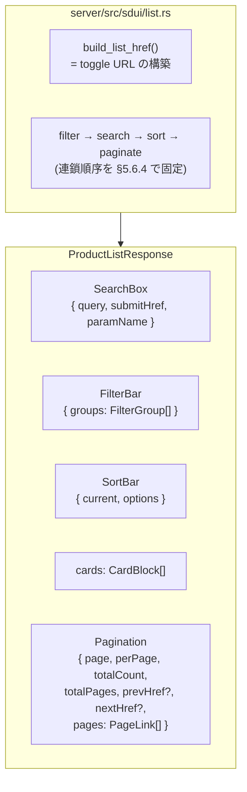

**重要な不変条件**: **トグル URL はサーバが必ず返す**。クライアントは `<a href={chip.href}>` するだけ。理由は (a) JS 無しでも動く progressive enhancement、(b) URL の正規化責務を **サーバに集約** してフロント・サーバの両方で URL を組まない。

#### Server-driven state pattern

カート qty・チェックアウトのフォーム値は、すべて **「PATCH 成功後に必ず再 fetch」** で UI に反映する。

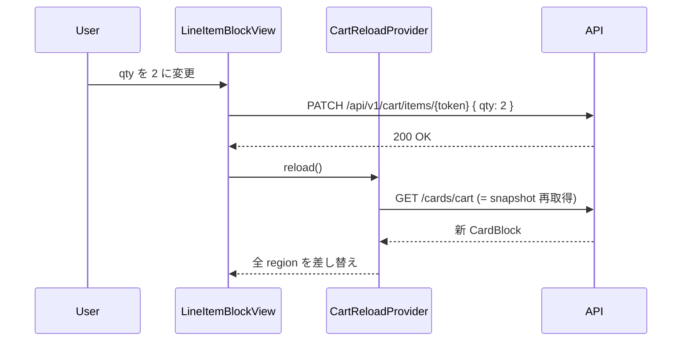

**狙い**: クライアントが値を局所更新すると、サーバ側の derived value (= 小計・送料・在庫) との二重実装になる。常に **サーバを真実値** とし、ローカル mutation を持たないことで「カートと表示が食い違う」事故を防ぐ。

**race / focus 対策**: 入力中の値巻き戻し・PATCH 逆順到着の防止策は仕様書 §11.8 に明記 (= input フォーカス保持、サーバ往復中は楽観適用しない)。

### 6.8 i18n 規約 (Localizable)

UI 文字列は 2 通りで配信する。

```typescript
type Localizable =
  | { source: "i18n"; key: I18nKey; params?: Record<string, string|number> }
  | { source: "raw"; text: string };
```

- **`source: "i18n"`**: client 側の辞書 (`sdui/i18n/dict.ts`) で解決。CI で **キー網羅** をチェック (`bun run check:i18n:strict`)、本番で空文字フォールバックが起きないことを保証。
- **`source: "raw"`**: 個別商品名・ユーザー入力など、辞書化できない値。

`I18nKey` は branded 型で、生 string を `key` 欄に入れるとコンパイルエラーになる。

### 6.9 C2C ピボットによる現在地

migration 0021 (= C2C ピボット) で旧 B2C 商品テーブルが消えた結果、**SDUI の出口エンドポイントは過渡期**にある。

| 項目 | C2C ピボット前 | 現在 |
|---|---|---|
| `/api/v1/cards/products`, `/cards/products/{id}` | あり | **撤去済**。listings は通常の REST (`/listings`) で配信、カード組み立ては FE 側 |
| `/api/v1/cards/cart` | あり | **撤去済**。FE 側で listings から CartCard を組む暫定方針 |
| `/api/v1/events` (analytics) | あり | **稼働中** |
| `/api/v1/checkout/shipping_field/{name}` 等 | あり | **稼働中** |
| Rust 型定義 (`server/src/sdui/`) | 全種 | **全種残置**。ts-rs / schemars 生成も継続 |

**理由**: 型の真実値を残し、運営 CMS / 管理画面 / A/B テスト基盤を導入するときに **再び card endpoint を生やせる** ようにしてある。型を捨てると再導入時に三層モデルから作り直しになるため、コストが小さい型と検証だけは保持している。

### 6.10 SDUI のトレードオフ

| 観点 | 利点 | 妥協 |
|---|---|---|
| **CMS / A/B テストの土台** | カードのコピー・順序・CTA を JSON 配信で差し替え可能、`Experiment.bucket` をブロック単位で持てる | 通常 REST より JSON 構造が深く、デバッグ時の認知負荷が増える |
| **型安全** | Rust → TS / JSON Schema 二重生成、`branded` で生 string 混入を防ぐ | パイプライン (= cargo test + gen スクリプト) が壊れると client がビルドできない。CI ガード必須 |
| **a11y / 一貫性** | `ValidateA11y` で headline 重複を deserialize 段階で弾く、Role が CSS class 経由で固定 | 「画面ごとの完全自由レイアウト」はできない。SDUI 範囲外で逃がす設計 |
| **server-driven state** | カート・在庫・送料の表示が常にサーバと一致 | mutation のたびに再 fetch、レイテンシが UI に出る (= 入力 focus 保持で緩和) |
| **toggle URL を server に集約** | JS 無しで動く / URL canonicalization が 1 箇所 | client が「現在選択」を server に毎回問い合わせる必要 (= 楽観 UI を捨てる) |
| **C2C ピボット後の過渡期** | 型は残してあり、再導入が容易 | エンドポイントの一時撤去で「SDUI のフルパス」を踏むテストがしばらく回らない |

### 6.11 レビュー観点 (SDUI 固有)

1. **適用範囲の判断**: 一覧 / 詳細 / カート / チェックアウトに限定して採用しているが、入力フォーム (個体登録 / 出品作成) は **通常の Solid コンポーネント** に倒している。この境界 (= 「変動する UI vs 安定する UI」) の引き方は妥当か。
2. **CMS 化のタイミング**: 現状はサーバが Rust コードでカードを組み立てており、DB 駆動ではない。CMS 化のフェーズ追加条件 (例: 「マーケ運用が月 N 回コピー変更する」) を観測指標として持つべきか。
3. **C2C ピボット後の過渡期**: 出口エンドポイントを撤去したまま型を残す判断は許容範囲か。型の検証 (二重生成 + property-based test) で実害が出ないかの確認。
4. **server-driven state のレイテンシ**: 再 fetch 方式は MVP で十分だが、規模拡大時は `BroadcastChannel` でタブ間同期 + push (= WebSocket) に拡張するロードマップが書かれている (`v6 §11.8`)。これで十分か。

---

## 7. 主要シーケンス

### 7.1 購入確定 → 所有権移転 (本サービスの肝)

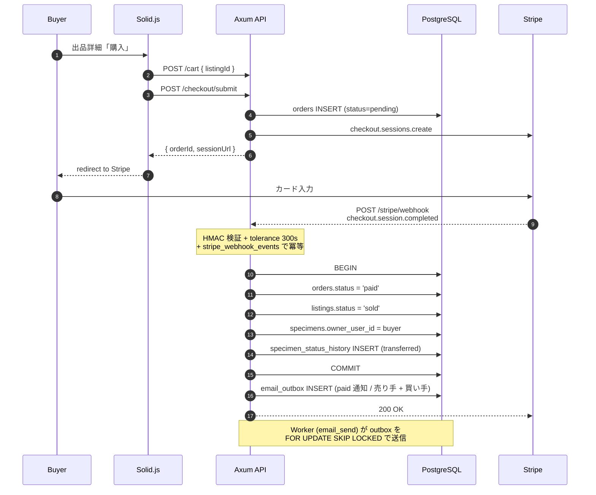

**ポイント**

- 所有権移転 + 出品クローズ + 注文確定は **同一トランザクション**。中途半端な状態を作らない。
- `stripe_webhook_events` で event_id を冪等キャッシュ化、後続の handler が失敗した場合は best-effort で `delete_by_id` ロールバックして Stripe の retry を受け入れる (`server/src/handlers/stripe_webhook.rs`)。
- 通知は `email_outbox` への INSERT で完了とみなし、Worker が後段で SES に送る (= 送信失敗が購入トランザクションを巻き戻さない)。

### 7.2 認証 + Cookie session 昇格

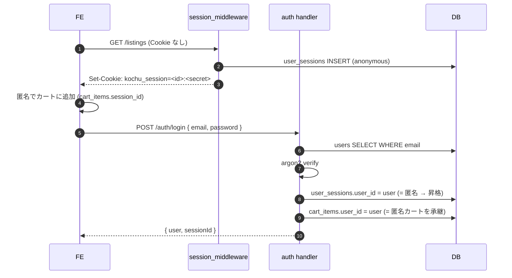

匿名で買い物していても、ログイン時に **同じ Cookie session** に user を紐付けるためカートが消えない (`promote_session_to_user`)。

### 7.3 画像アップロード (= サーバを経由しない)

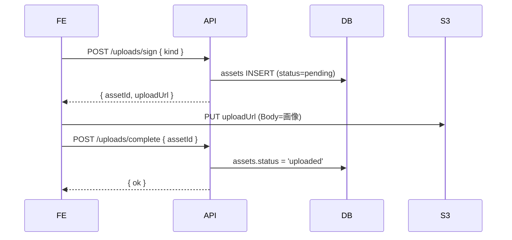

サーバは帯域に乗らない。`assets` は `target_kind` で listing / specimen / log と紐づけ (migration 0017, 0023)。

---

## 8. デプロイ図 (AWS)

実コードはまだクラウドへ流していないが、`README.md` と `docs/infra/` の方針に基づく目標構成。

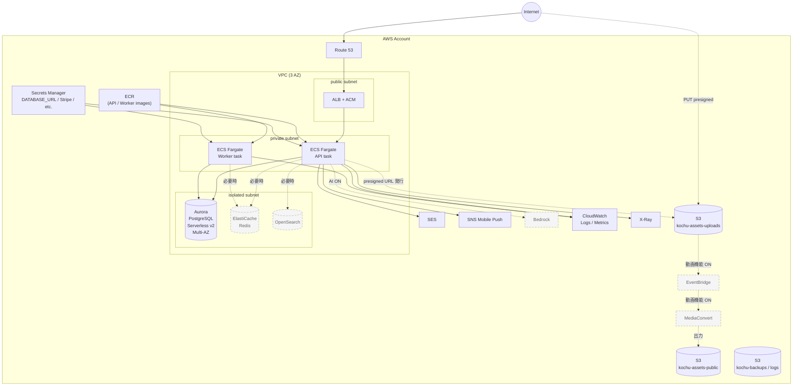

| 観点 | 設計 | 理由 |
|---|---|---|
| ネットワーク | public / private / isolated の 3 段 subnet | DB を Internet からも ALB からも直接見えない位置に置く |
| 配置 | ECS Fargate (API / Worker 別 task) | EC2 を抱えたくない / 長時間 Worker を API と同居させない |
| シークレット | Secrets Manager → ECS Task Definition で injection | env を Git に持たない |
| バックアップ | Aurora 自動 + AWS Backup (30 日) | 個体カルテと取引履歴は失えない |
| 監視 | CloudWatch + X-Ray (OTel 経由) | AWS 内に閉じ、外部 SaaS を増やさない |
| IaC | (未確定) CDK / Terraform | POC 段階では手動許容、本番化前に確定 |

---

## 9. 技術選定の理由とトレードオフ

外部レビュアーが最も気にするのはここ。判断と引き換えに何を諦めたかを明記する。

### 9.1 言語 / フレームワーク

| 選択 | 理由 | 諦めたもの |
|---|---|---|
| **Rust + Axum** | 型安全 (= sqlx の compile-time 検証 + utoipa)、低 idle メモリ、async が成熟 | エンジニア採用難度、コンパイル時間。`mold` + ワークスペース分割で緩和方針 |
| **Solid.js (PWA)** | きめ細かい reactivity、React より軽量、PWA で iOS 体験を補完できる | エコシステム規模は React に劣る。ライブラリは自前実装に倒れがち |
| **iOS は Swift / SwiftUI**、**Android は無し (PWA で代替)** | 飼育者の写真ワークフローはモバイル中心、まずは iOS の体験品質を最大化 | Android ネイティブの体験は犠牲 (= MVP では割り切り) |

### 9.2 API 設計

| 選択 | 理由 | 諦めたもの |
|---|---|---|
| **REST + OpenAPI (utoipa)** | Rust → Swift / TS 全方向で型を生成、契約違反を構造的に防ぐ | GraphQL のクライアント駆動の柔軟さ。N+1 は手動で対処 |
| **Cookie session (HttpOnly + SameSite=Lax + Argon2id 検証)** | XSS で Bearer 漏洩しない / 匿名 → user 昇格でカート承継しやすい | 完全 stateless にならず DB に session 表を持つ (= MVP の規模で問題なし) |
| **CSRF: `Origin` ヘッダ allowlist** | env CSV で運用しやすい、token を画面に持ち回らなくて済む | プロキシ経由で Origin が消える環境への配慮が必要 (= ALB は維持する想定) |

### 9.3 データ層

| 選択 | 理由 | 諦めたもの |
|---|---|---|
| **PostgreSQL 単一 DB に集約** | 取引・カルテ・session・outbox を 1 トランザクションで触れる、JSONB で柔軟性確保 | スケールアウトの単純化 (read replica で対応想定) |
| **検索は当面 `pg_trgm` GIN** | 専用検索エンジンを増やさない、運用が DB 1 種で完結 | 関連度ランキング・facet 検索は弱い。出品数増 → OpenSearch 投入 |
| **状態遷移は履歴テーブルで不可逆化** (`specimen_status_history`) | 監査要件 + 「死着・偽申告」のトラブル時に証拠が残る | 書き込み回数が増える (= ストレージ・index コストは許容) |
| **金額は BIGINT + 円単位** | 為替・小数誤差を回避、JPY のみの想定で十分 | 多通貨対応時はマイグレーション必要 |
| **画像はクライアントから S3 直接 PUT** | サーバ帯域を使わない、ECS Fargate のスケールに引きずられない | 署名 URL 期限切れ時の UX に注意 (= リトライで再発行) |

### 9.4 段階追加方針 (= MVP に入れない判断の根拠)

「いつ・なぜ追加するか」を先に書くことで、過剰建築を防ぐ。

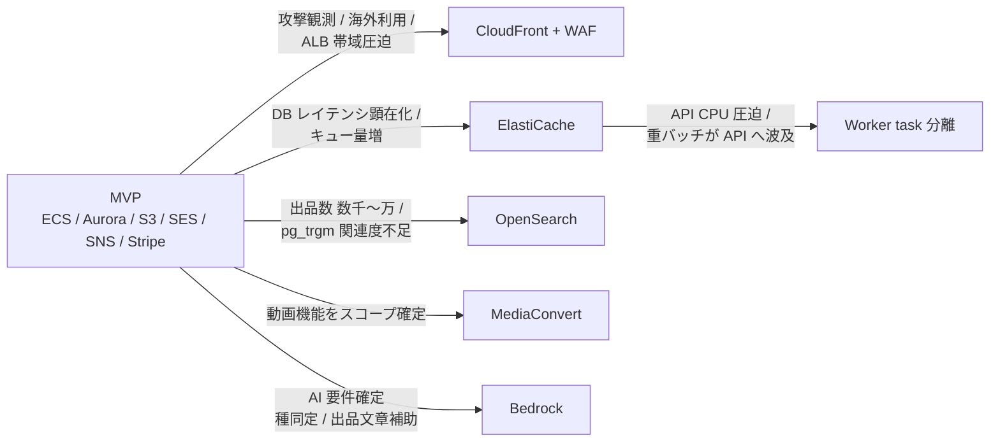

**逆に言うと**: ここに書いていない「便利そう」は MVP では入れない。レビュアーは「足りないのでは」と感じた項目を、この表のどの発動条件で起きるかで詰めてほしい。

### 9.5 既知の妥協 (= レビューしてほしい論点)

| 論点 | 現状 | リスク | 想定対処 |
|---|---|---|---|
| `AppState.db: Option<PgPool>` | dev で DB 不在を許容、in-memory fallback あり | production で誤って fallback に倒れる可能性 | `KOCHU_ENV=production` 時は `init_pool` 直接呼び出しに切り替え |
| Webhook 失敗時の DLQ | 現状はログのみ | Stripe / EventBridge 再送に頼り切り | SQS DLQ 化 + 運用 alarm 化 (= MediaConvert 投入と同タイミング) |
| `checkout` のサーバ側 state | プロセス内 `Mutex<CheckoutState>`、single-user | 複数インスタンスで破綻 | DB or Redis 化 (= Phase 8+ で対応) |
| `pg_trgm` での日本語形態素 | 実装上 trigram。漢字含みの精度は限定的 | 出品が増えるとノイズ大 | OpenSearch (kuromoji) へ前倒しの可能性 |
| 楽観ロック | `version` 列はある (`listings` 等) が API レイヤで未活用 | 同時編集で last-writer-wins | 競合する画面 (= 出品編集) で `If-Match` ヘッダ導入 |
| トランザクション境界 | `paid` 遷移内の SQL 群は同一 tx を意図、コードレベルで未検証部分あり | 一部書き込みが部分的に成功するリスク | integration test を増やす (`server/tests/`) |

---

## 10. レビュー観点チェックリスト

このドキュメントを読んだあと、特にフィードバックが欲しいのは以下。

1. **C2C モデルの集約境界**: `users` / `specimens` / `listings` / `orders` の責務分離が現実の取引トラブル (= 死着・偽申告・遅延発送) にどこまで耐えるか。
2. **Webhook 信頼性**: §7.1 のトランザクション設計と冪等性キャッシュの組合せで、Stripe の重複送信・順序前後・再送に十分か。
3. **段階追加方針** (§9.4): 発動条件 (= "なに" を見て追加するか) が観測可能か (= CloudWatch Metric / RUM / アラート設計に落とせるか)。
4. **AWS 単一ベンダー**: §1.1 の通り依存は AWS と Stripe / APNs に集約。これに伴うベンダーロックの影響を抽象境界 (= `repos/*` と `stripe/*`) でどこまで吸収できているか。
5. **MVP に入れていない領域** (Android / 動画 / AI / SMS / 多言語): 事業上のクリティカルパスから外せている根拠は妥当か。

---

## 付録 A: 参照 (社内ドキュメント)

| ファイル | 内容 |
|---|---|
| [`README.md`](../README.md) | 技術スタック詳細、開発環境セットアップ、AWS 移行方針 |
| [`db_design.md`](../db_design.md) | 全テーブル定義 / 制約 / index (※ §3 の products 系は C2C ピボットで失効) |
| [`docs/api-v1-endpoints.md`](api-v1-endpoints.md) | REST API 一覧 |
| [`docs/breeder-pivot-and-features.md`](breeder-pivot-and-features.md) | C2C ピボットの背景と機能設計 |
| [`system-design-report.md`](../system-design-report.md) | ビジネス含む 15 分版概要 (= 上長向け) |
| [`server/migrations/`](../server/migrations/) | 0001〜0026 の DDL (= 真の schema 定義) |
| [`server/src/routes.rs`](../server/src/routes.rs) | API endpoint の真の一覧 |
| [`diagrams/architecture.drawio`](../diagrams/architecture.drawio) | draw.io 編集可のアーキテクチャ図 |
| [`diagrams/er-diagram.drawio`](../diagrams/er-diagram.drawio) | draw.io 編集可の ER 図 |

---

**まとめ**: KOCHU は「所有者の付け替え」を中心に C2C 取引と飼育履歴を結ぶ単純なデータモデルを、Rust + Axum + PostgreSQL という型と整合性を取りやすい技術スタックで実装している。MVP は AWS マネージド + Stripe + APNs の最小構成で立ち上げ、検索・キャッシュ・動画・AI は明示的な発動条件が観測されてから段階的に追加する。レビュアーには §6 の SDUI 採用範囲・§9.5 の「既知の妥協」・§10 のチェックリストを起点に、事業要件と設計の整合を確認してほしい。
