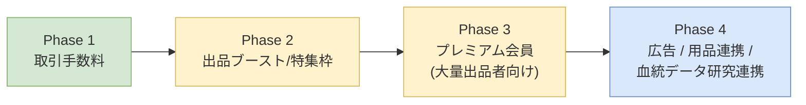
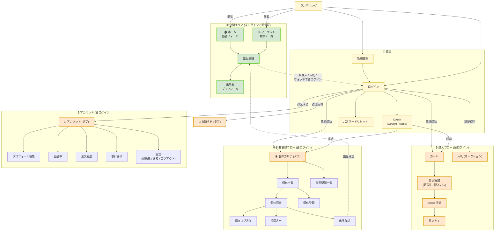
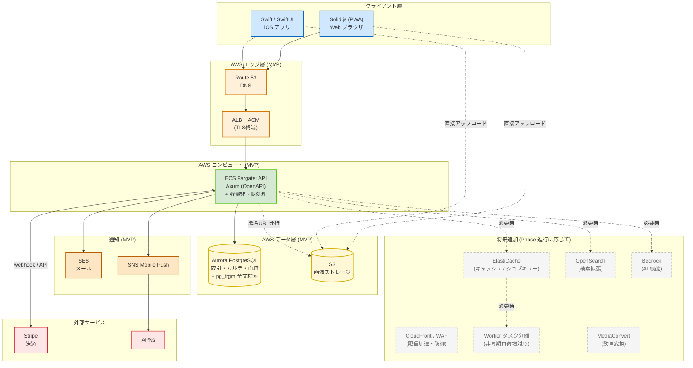
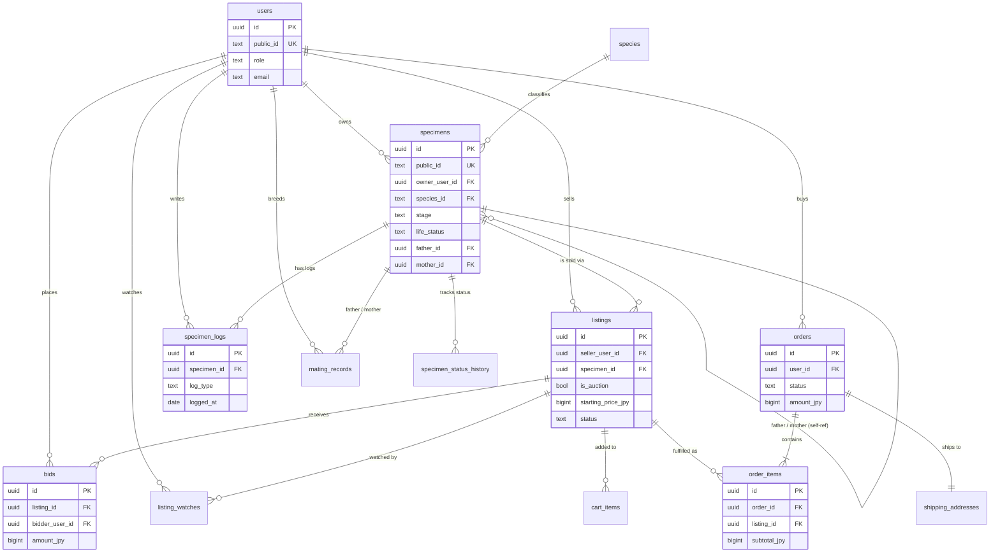
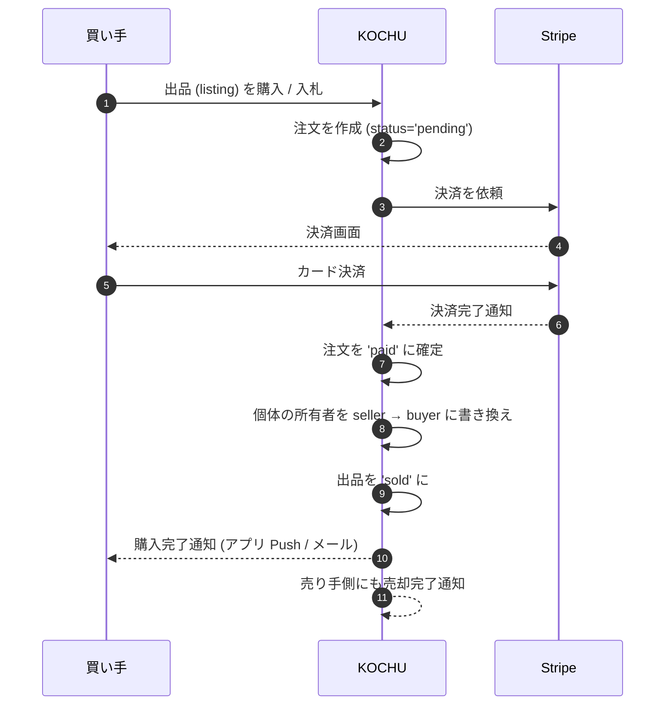

# KOCHU insect_app システムデザイン報告書

**対象**: 上長向け / 事業・システム概要
**作成日**: 2026-05-06
**スコープ**: 事業の位置づけ・狙い・全体構成を 15 分で把握できる粒度で説明する。技術詳細は `README.md` / `db_design.md` / `docs/api-v1-endpoints.md` に分離。

---

## 1. 概要

### 1.1 プロダクトの 1 行サマリー

> **ブリーダーが安心して個体を取引できる、飼育の歴史と血統が紐づいた C2C マーケットプレイス。**

カブトムシ・クワガタ等の昆虫を継代繁殖するブリーダー同士が、自分の育てた個体を直接売買できる。出品される 1 匹ごとに **飼育カルテ (specimen card)** と **血統 (親子関係)** が紐づき、買い手は履歴を確認したうえで購入できる。取引が成立すると、システム上でも個体の所有権が seller から buyer に移管される。

### 1.2 解決したい課題

国内の昆虫ブリーダー市場は、現状以下の構造的な問題を抱えている。

- **取引が場当たり的**: ヤフオク・メルカリ・SNS DM が主流で、個体ごとの飼育履歴や血統情報が取引時に消える。
- **信頼担保のコストが高い**: 死着・羽化不全・系統偽申告のトラブル時に、証拠 (写真・記録・親個体情報) が散在しており、ブリーダー側の信用も買い手側の安心も成立しにくい。
- **飼育記録の分断**: 飼育者は個別アプリ・Excel・手書きで記録しており、出品時に再入力が必要。出品後は記録が二度と取り出されない。

### 1.3 提供価値

| 価値の柱 | 具体 |
|---|---|
| **透明性** | 出品ページから飼育履歴・親個体・脱皮ログを誰でも確認できる |
| **信頼性** | ブリーダーごとに取引履歴・評価が蓄積され、長期的な評判が可視化される |
| **省力化** | 飼育管理アプリとしても独立して使え、出品時はワンクリックで履歴を引き継げる |
| **継承** | 親子関係が DB 上で接続され、世代を超えた血統 (= ブリーダーの資産) を可視化 |

### 1.4 ビジョン

「ブリーダー個人の **積み重ね** が、世代を超えて評価される市場をつくる」。
飼育記録が単なる思い出ではなく、取引価値・信頼指標・血統データとして残ることで、長期で続けるブリーダーほど報われるエコシステムを目指す。

---

## 2. 市場とマーケティング

### 2.1 ターゲットユーザー

| セグメント | 規模感 | プロダクトでの重要度 |
|---|---|---|
| **中〜上級ブリーダー (主に売り手)** | 国内 1〜3 万人想定 | 最重要。出品の供給源であり、口コミの起点 |
| **初級ブリーダー (主に買い手)** | 国内 5〜10 万人想定 | 市場の流動性を支える需要側 |
| **これから始める層 (見込み客)** | より広範 | 飼育管理アプリ (取引なし) を入口にできる層 |

### 2.2 競合と差別化

| 既存の取引手段 | 強み | 本サービスの差別化点 |
|---|---|---|
| ヤフオク | 既存利用者が多く、即金性が高い | **個体カルテと血統が紐づく**。評価が累積する。専門カテゴリ最適化 |
| メルカリ | 利用ハードル低い | 生体取引に対応した **温度便・配送便の選択肢**、種別検索、信頼マーク |
| 専門ショップ (B2C) | 種類が揃う・初期信頼性が高い | C2C なので **ブリーダーが直接利益を得られる**、買い手とブリーダーが繋がる |
| SNS DM 取引 | 個別交渉の柔軟性 | **エスクロー決済**でトラブル時の保護、客観的な評価ストック |

### 2.3 提供価値の柱 (マーケティング メッセージ)

事業として打ち出すコアメッセージは 3 つに集約する。

1. **「育てた歴史ごと、売れる」** — 飼育記録 + 親個体 + 写真 = 売り手の説得材料
2. **「買って終わり、にしない」** — 購入後そのまま飼育管理アプリとして継続利用
3. **「ブリーダーの名前が、価値になる」** — 評価・取引履歴・血統が個人の信用として残る

### 2.4 収益モデル (段階展開)

| Phase | モデル | 想定タイミング |
|---|---|---|
| 1 | 取引手数料 (落札額の一定 %) | ローンチ初期 |
| 2 | 出品ブースト / 特集枠 (出品者が支払う) | 流動性が出てから |
| 3 | プレミアム会員 (大量出品者向け / 月額) | コア出品者が定着してから |
| 4 | 広告 / 用品レコメンド / 血統データ研究機関連携 | スケール段階 |

### 2.5 Go-To-Market 戦略

供給側 (ブリーダー) を先に獲得しないと需要が動かない、典型的な **マーケットプレイスの初期モデル**。

- **大会 / コミュニティ起点**: 大会・即売会・ブリーダー集会に出向き、人気ブリーダーに無償出品枠と評価ヘッドスタートを提供
- **SNS 連動**: 出品ページ・血統図を SNS で共有しやすい OGP 設計、ブリーダーの自己発信を後押し
- **飼育管理アプリ単独利用の許容**: 取引機能を使わなくても継続利用できる設計。LTV は長期で取りに行く
- **iOS から先行**: 飼育者の写真・動画ワークフローはモバイル中心。Android は PWA で最低限カバー

### 2.6 主要 KPI

| KPI | 意味 |
|---|---|
| **GMV (Gross Merchandise Value)** | 取引総額。事業の主指標 |
| **出品 → 落札の平均日数** | 流動性の代理指標 |
| **MAU 中の出品 / 購入転換率** | サイト訪問者がどれだけ動くか |
| **個体カルテの月次更新数** | 取引なしでも使われているかの健康指標 |
| **ブリーダーあたり平均評価数** | 信頼ストックの蓄積速度 |

---

## 3. 機能一覧

利用者から見える機能を、利用シーンごとに整理する。MVP スコープに含まれるものを基本とし、フェーズで追加するものは末尾の「将来追加機能」にまとめる。

### 3.1 アカウント・認証

- メール + パスワードでの登録 / ログイン
- OAuth (Google / Apple Sign In) によるソーシャルログイン
- プロフィール (公開ハンドル / 表示名 / アバター)
- パスワードリセット
- セッション管理 (Cookie ベース)

### 3.2 飼育管理 (個体カルテ)

- 個体の登録 (種・性別・計測値・取得日・取得元の記録)
- 飼育ログ (体重 / 餌 / マット / 脱皮 / 観察) の記録 + 写真添付
- 状態遷移の記録 (active / deceased / transferred / escaped) — 不可逆履歴
- 血統の管理 (父個体・母個体の自己参照、自由テキストフォールバックも可)
- 交配記録 (planned → mated → eggs_laid → hatched / failed)
- 個体のアーカイブ (古い個体を非表示化)

### 3.3 C2C 取引 (マーケットプレイス)

- 出品 (即決価格 / オークション形式)
- 入札 (オークションのみ)
- ウォッチリスト (気になる出品をフォロー)
- カート (ゲスト利用も可、ログイン後にマージ)
- 検索 (種別・価格帯・ブリーダー)
- ブリーダープロフィール (取引履歴・評価の蓄積)
- 信頼マーク (運営による認証ブリーダー表示)

### 3.4 注文・決済・配送

- Stripe による決済
- 配送先入力 (注文ごとに 1 件)
- 配送方法選択 (温度制御便 / 通常便)
- 決済確定で個体所有権を seller → buyer に **自動移転**
- 注文履歴 (購入側・販売側両方から確認可能)

### 3.5 通知

- メール通知 (取引完了 / 出品成立 / 入札・売却の動き)
- iOS プッシュ通知
- 通知の送信は非同期 (UI を遅延させない)

### 3.6 画像 (MVP) / 動画 (将来)

- 画像アップロード (クライアントから S3 へ直接 / presigned URL)
- 出品ページでの画像表示
- 動画はフェーズ進行に応じて追加 (MVP は画像のみ)

### 3.7 運営側機能

- ブリーダー認証マークの付与・解除
- Stripe webhook 履歴の参照 (90 日保持)
- 死着・偽申告など取引トラブルへの手動対応 (MVP は手動運用)
- 監査列 (誰が作った・更新したかの追跡)

### 3.8 将来追加機能 (発動条件次第)

- 横断検索の高度化 (関連度・facet — OpenSearch 投入時)
- 動画アップロード・再生 (MediaConvert 投入時)
- AI による種同定 / 出品文章補助 / レコメンド (Bedrock 投入時)
- SMS 通知 (要件確定時)
- 国内決済 (KOMOJU / GMO / Stripe 日本版 — フェーズ次第)
- 多言語対応 (現状は日本語のみ。翻訳テーブル `*_translations` で枠組みは準備済)
- **羽化予測** (一旦保留)

---

## 4. 画面遷移図

MVP スコープでの画面構成と主要な遷移を整理する。Web (PWA) と iOS で UI 部品は変わるが、画面の論理構造は共通。

### 4.1 全体マップ

公開エリア (未ログインで閲覧可) と、ログイン後にアクセスできるエリアを分けて図示する。**🔒** マークがログイン必須を示す。

### 4.2 画面の役割 (主要のみ)

| カテゴリ | 画面 | 役割 |
|---|---|---|
| 認証 | ランディング / ログイン / 新規登録 / OAuth / パスワードリセット | 入口とアカウント発行 |
| メインタブ | ホーム / マーケット / 個体カルテ / お知らせ / アカウント | 5 タブで全機能にアクセス |
| 購入 | 出品詳細 → カート → 注文確認 → Stripe 決済 → 注文完了 | C2C 取引のメインフロー (核) |
| 入札 | 出品詳細 → 入札 | オークション形式のとき |
| 飼育 | 個体一覧 / 個体詳細 / 個体登録 / 飼育ログ追加 / 系図 / 状態変更 | 飼育管理アプリとしての中心 |
| 交配 | 交配記録一覧 / 交配記録詳細 | planned → mated → 産卵 → 孵化 / 失敗 の進行管理 |
| 出品作成 | 個体詳細 → 出品作成 → 出品詳細 | 飼育履歴を引き継いでワンクリック出品 |
| アカウント | プロフィール編集 / 出品中 / 注文履歴 / 取引評価 / 設定 (配送先・通知・ログアウト) | 自分の活動の起点 |

### 4.3 画面遷移の設計上のポイント

- **5 タブで主要機能に到達**: 浅いツリー構造を維持し、深い階層を作らない (モバイル UX 優先)
- **「個体詳細 → 出品作成」が差別化の動線**: 既存個体の履歴をそのまま出品に引き継げることが、ヤフオク・メルカリと差がつく最大のポイント
- **購入フローは画面数を最小化**: 出品詳細 → カート → 注文確認 → 決済 → 完了 の 5 ステップ。1 画面で配送先・配送方法を兼ねる
- **未ログインでもマーケット閲覧は可能**: 流入を絞らないため、ホーム / マーケット / 出品詳細 / 出品者プロフィールは未ログインで閲覧可。購入・入札・ウォッチ・出品・アカウント機能を使う段階で初めてログインを要求する

---

## 5. システム全体像

> **構築方針**: MVP は **必要最小限** の構成で立ち上げ、利用が増えてから検索・キャッシュ・動画変換・AI 等の専用サービスを段階的に追加する。AWS 外の依存は決済 (Stripe) と Apple のプッシュ通知 (APNs) のみ。

### 5.1 全体構成図 (MVP + 将来追加)

実線が **MVP で実際に建てるもの**、破線が **段階的に追加するもの** (Phase 進行 / 利用量に応じて)。

### 5.2 MVP 構成のコンポーネント

| 層 | コンポーネント | 役割 |
|---|---|---|
| クライアント | Web (PWA) / iOS | 利用者が触る画面。両者で同等の体験 |
| エッジ | Route 53 + ALB + ACM | DNS と公開エンドポイント。TLS は ACM で終端 |
| コンピュート | ECS Fargate (API 単独タスク) | Axum 1 本で API + 軽量な非同期処理を兼任 |
| データ | Aurora PostgreSQL | 取引 / 個体カルテ / 血統 / 検索 (`pg_trgm` 全文検索) を 1 個の DB に集約 |
| ストレージ | S3 | 画像をクライアントから直接アップロード (presigned URL) |
| 通知 | SES + SNS Mobile Push | メールと iOS プッシュ。どちらも転送系で運用負荷小 |
| 外部 | Stripe / APNs | 決済と Apple プッシュ。代替不可の外部依存 |

### 5.3 将来追加するサービス (発動条件)

「いつ」「何があったら」追加するかを決めておくと、必要以上に作り込まずに済む。

| サービス | 追加の発動条件 |
|---|---|
| **CloudFront / WAF** | 攻撃試行が観測された / 海外利用が増えた / 画像トラフィックが ALB 帯域を圧迫し始めた |
| **ElastiCache (Redis)** | DB クエリのレイテンシが目立つ / バックグラウンドジョブ量が DB ベースキューでさばけない量に達した |
| **Worker タスク分離** | API タスクの CPU が非同期処理で食い荒らされる / 重いバッチが API レイテンシに影響し始めた |
| **OpenSearch Service** | 出品数が数千〜万件に達し、`pg_trgm` 全文検索のレイテンシ・関連度精度が不足した |
| **MediaConvert** | 動画機能を正式に MVP スコープに追加した時 (現状は画像のみ) |
| **Bedrock (AI)** | 種同定 / 推奨 / 文章補助等の AI 機能を要件として確定した時 |

> いずれも **アプリ層を抽象境界で隔離** しておくことで、後付けでも実装影響を局所化できる設計にする。

---

## 6. データモデル (ER 図)

### 6.1 主要エンティティ関係図

C2C 取引・飼育管理・ユーザーの 3 ドメインをまたぐ関係に絞って図示。

### 6.2 ドメイン構成のひと言まとめ

| ドメイン | 役割 |
|---|---|
| **user** | ブリーダー本体。役割・公開ハンドル・認証情報を持つ |
| **specimen** | 個体カルテ。所有者・種・親個体 (自己参照) を持ち、譲渡で所有者が変わる |
| **market** | 出品 / 入札 / ウォッチ。出品は specimens に紐づく |
| **order** | 注文ヘッダ・明細・配送先。注文時点の snapshot を保持し、出品が消えても注文は残る |

> **設計の要**: 「所有者の付け替え」だけで C2C 取引と飼育履歴の継承が同時に成立する。出品・購入・譲渡は同じ DB の異なる側面を見ているにすぎない。

---

## 7. 主要ユースケース

### 7.1 C2C 購入フロー (出品 → 購入 → 譲渡)

本システムの肝は「**購入確定 = 個体の所有権移転**」。決済完了をトリガに、システム上でブリーダー間の個体オーナーシップが書き換わる。

**ポイント**: 注文確定・所有権移転・出品クローズは同一トランザクションで行い、いずれかが失敗したら全体を巻き戻す。これにより「お金は払ったが個体が移ってない」「個体は移ったが出品が残っている」状態を防ぐ。

---

## 8. 現状と今後の見通し

スキーマ整備の進捗:

| Phase | 状況 | 主な内容 |
|---|---|---|
| 〜 0011 | 完了 | ユーザー / 注文 / 個体 / 出品 / Stripe 連携の主要スキーマ整備 |
| 0012〜0020 | 完了 | 配送先・パスワードリセット・メール送信・アセット管理など補助系 |
| **0021 (C2C ピボット)** | **完了** | 旧 B2C 商品系を全廃し、出品 (listings) を一本化 |

インフラ展開のロードマップ (= 5.3 と整合):

| Phase | スコープ | 主な内容 |
|---|---|---|
| **MVP ローンチ** | 必要最小構成 | ECS Fargate / Aurora / S3 / SES / SNS Mobile Push / Stripe |
| Phase 1 (利用増対応) | キャッシュ・配信強化 | ElastiCache / CloudFront / WAF を必要に応じて追加 |
| Phase 2 (機能拡張) | 動画・検索 | MediaConvert (動画スコープ確定後) / OpenSearch (検索不足時) |
| Phase 3 (差別化) | AI 機能 | Bedrock (種同定 / 推奨 / 文章補助 等の要件が固まったら) |

**保留中の機能**: 羽化予測機能は一旦保留 (将来再開検討)。

---

## 9. リスクと留意事項

| 項目 | 内容 | 対応方針 |
|---|---|---|
| C2C モデレーション | ブリーダー間取引のトラブル (死着・系統偽申告等) | ブリーダー認証マーク + 取引評価の蓄積。当初は手動運用で割り切り |
| 供給側の立ち上げ | マーケットプレイスは売り手 (出品者) が先に集まらないと動かない | 大会・コミュニティ起点で人気ブリーダーを先行獲得。飼育管理アプリ単独利用も許容 |
| 動画ストレージ費用 | 個体動画の蓄積で AWS のストレージ・配信費用が読みづらい | 古いアセットの自動 tier 移行・クォータ・視聴頻度で課金を最適化 |
| 規制 / 検疫 | 海外種輸入や種固有の法規制 | 当面は国内流通種のみに絞る。海外展開はフェーズ 4 以降 |
| ベンダーロックイン | AWS 全面採用で他クラウド移行が重くなる | 業務ロジック層と AWS 直接呼び出し層を分離。長期的にも切替コストを抑える設計 |
| iOS / Web の機能差 | カメラ・通知体験はネイティブが優位 | API は同一、UI 側で吸収。Android はスコープ外を維持 |

---

## 10. 参考資料 (社内)

- `README.md` — 技術スタック詳細・開発環境セットアップ
- `db_design.md` — 全テーブルのカラム定義・制約・インデックス
- `docs/api-v1-endpoints.md` — REST API 一覧
- `docs/breeder-pivot-and-features.md` — C2C ピボットの背景と機能設計
- `diagrams/architecture.drawio` — システム全体図 (draw.io 編集可)
- `diagrams/er-diagram.drawio` — ER 図 (draw.io 編集可)
- `diagrams/screens.drawio` — 画面遷移図 (draw.io 編集可)

---

**まとめ**: KOCHU insect_app は「飼育の歴史」と「取引の信頼」を 1 つのデータモデルでつなぐ C2C マーケットプレイスである。事業としては「ブリーダーの積み重ねが価値になる」という一貫したメッセージで、既存の取引手段が持つ "履歴が消える" "信頼が積み上がらない" という課題を解く。インフラは **MVP では必要最小構成** (ECS Fargate / Aurora / S3 / SES / SNS Mobile Push / Stripe) で立ち上げ、検索・キャッシュ・動画・AI 等の専用サービスは利用量や機能要件が固まったタイミングで段階的に追加する。供給側の獲得から始め、取引手数料 → 出品ブースト → プレミアム会員と段階的にマネタイズを広げていく方針を取る。
